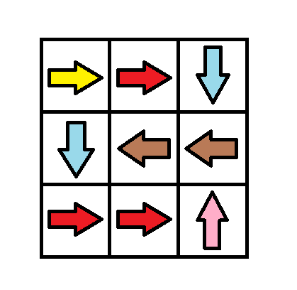

<h1>1368. Minimum Cost to Make at Least One Valid Path in a Grid</h1>
Given an m x n grid. Each cell of the grid has a sign pointing to the next cell you should visit if you are currently in this cell. The sign of grid[i][j] can be:

<li>1 which means go to the cell to the right. (i.e go from grid[i][j] to grid[i][j + 1])</li>
<li>2 which means go to the cell to the left. (i.e go from grid[i][j] to grid[i][j - 1])</li>
<li>3 which means go to the lower cell. (i.e go from grid[i][j] to grid[i + 1][j])</li>
<li>4 which means go to the upper cell. (i.e go from grid[i][j] to grid[i - 1][j])</li>
Notice that there could be some signs on the cells of the grid that point outside the grid.

You will initially start at the upper left cell (0, 0). A valid path in the grid is a path that starts from the upper left cell (0, 0) and ends at the bottom-right cell (m - 1, n - 1) following the signs on the grid. The valid path does not have to be the shortest.

You can modify the sign on a cell with cost = 1. You can modify the sign on a cell one time only.

Return the minimum cost to make the grid have at least one valid path.

 

<h3>Example 1:</h3>


Input: grid = [[1,1,1,1],[2,2,2,2],[1,1,1,1],[2,2,2,2]]
Output: 3
Explanation: You will start at point (0, 0).
The path to (3, 3) is as follows. (0, 0) --> (0, 1) --> (0, 2) --> (0, 3) change the arrow to down with cost = 1 --> (1, 3) --> (1, 2) --> (1, 1) --> (1, 0) change the arrow to down with cost = 1 --> (2, 0) --> (2, 1) --> (2, 2) --> (2, 3) change the arrow to down with cost = 1 --> (3, 3)
The total cost = 3.
<h3>Example 2:</h3>


Input: grid = [[1,1,3],[3,2,2],[1,1,4]]
Output: 0
Explanation: You can follow the path from (0, 0) to (2, 2).
<h3>Example 3:</h3>


Input: grid = [[1,2],[4,3]]
Output: 1
 

Constraints:

<li>m == grid.length</li>
<li>n == grid[i].length</li>
<li>1 <= m, n <= 100</li>
<li>1 <= grid[i][j] <= 4</li>

<h2>Answer</h2>
<h3>Python</h3>

```c
from collections import deque

class Solution:
    def minCost(self, grid):
        m, n = len(grid), len(grid[0])
        vis = [[False] * n for _ in range(m)]
        q = deque([(0, 0, 0)])  # (i, j, d)
        dirs = [(0, 0), (0, 1), (0, -1), (1, 0), (-1, 0)]

        while q:
            i, j, d = q.popleft()

            if i == m - 1 and j == n - 1:
                return d
            if vis[i][j]:
                continue
            vis[i][j] = True

            for k in range(1, 5):
                x, y = i + dirs[k][0], j + dirs[k][1]
                if 0 <= x < m and 0 <= y < n:
                    if grid[i][j] == k:
                        q.appendleft((x, y, d))
                    else:
                        q.append((x, y, d + 1))

        return -1

```

<h3>Java</h3>

```c

class Solution {
    public int minCost(int[][] grid) {
        int m = grid.length, n = grid[0].length;
        boolean[][] vis = new boolean[m][n];
        Deque<int[]> q = new ArrayDeque<>();
        q.offer(new int[] {0, 0, 0});
        int[][] dirs = {{0, 0}, {0, 1}, {0, -1}, {1, 0}, {-1, 0}};
        while (!q.isEmpty()) {
            int[] p = q.poll();
            int i = p[0], j = p[1], d = p[2];
            if (i == m - 1 && j == n - 1) {
                return d;
            }
            if (vis[i][j]) {
                continue;
            }
            vis[i][j] = true;
            for (int k = 1; k <= 4; ++k) {
                int x = i + dirs[k][0], y = j + dirs[k][1];
                if (x >= 0 && x < m && y >= 0 && y < n) {
                    if (grid[i][j] == k) {
                        q.offerFirst(new int[] {x, y, d});
                    } else {
                        q.offer(new int[] {x, y, d + 1});
                    }
                }
            }
        }
        return -1;
    }
}
```
