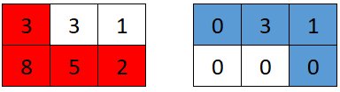
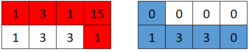

 to python
 <h1>2017. Grid Game</h1>
You are given a 0-indexed 2D array grid of size 2 x n, where grid[r][c] represents the number of points at position (r, c) on the matrix. Two robots are playing a game on this matrix.

Both robots initially start at (0, 0) and want to reach (1, n-1). Each robot may only move to the right ((r, c) to (r, c + 1)) or down ((r, c) to (r + 1, c)).

At the start of the game, the first robot moves from (0, 0) to (1, n-1), collecting all the points from the cells on its path. For all cells (r, c) traversed on the path, grid[r][c] is set to 0. Then, the second robot moves from (0, 0) to (1, n-1), collecting the points on its path. Note that their paths may intersect with one another.

The first robot wants to minimize the number of points collected by the second robot. In contrast, the second robot wants to maximize the number of points it collects. If both robots play optimally, return the number of points collected by the second robot.

 

<h3>Example 1:</h3>


Input: grid = [[2,5,4],[1,5,1]]
Output: 4
Explanation: The optimal path taken by the first robot is shown in red, and the optimal path taken by the second robot is shown in blue.
The cells visited by the first robot are set to 0.
The second robot will collect 0 + 0 + 4 + 0 = 4 points.
<h3>Example 2:</h3>


Input: grid = [[3,3,1],[8,5,2]]
Output: 4
Explanation: The optimal path taken by the first robot is shown in red, and the optimal path taken by the second robot is shown in blue.
The cells visited by the first robot are set to 0.
The second robot will collect 0 + 3 + 1 + 0 = 4 points.
<h3>Example 3:</h3>


Input: grid = [[1,3,1,15],[1,3,3,1]]
Output: 7
Explanation: The optimal path taken by the first robot is shown in red, and the optimal path taken by the second robot is shown in blue.
The cells visited by the first robot are set to 0.
The second robot will collect 0 + 1 + 3 + 3 + 0 = 7 points.
 

Constraints:

<li>grid.length == 2</li>
<li>n == grid[r].length</li>
<li>1 <= n <= 5 * 104</li>
<li>1 <= grid[r][c] <= 105</li>

<h2>Answer</h2>
<h3>Java</h3>

```c
import java.util.*;

class Solution {
    public long gridGame(int[][] grid) {
        int n = grid[0].length;
        if (n < 2) return 0;

        long topSum = 0;
        for (int val : grid[0]) {
            topSum += val;
        }

        long bottomSum = 0;
        long minSum = Long.MAX_VALUE;

        for (int pp = 0; pp < n; ++pp) {
            topSum -= grid[0][pp];
            minSum = Math.min(minSum, Math.max(topSum, bottomSum));
            bottomSum += grid[1][pp];
        }

        return minSum;
    }
}
```
<h3>Kotlin</h3>

```c
class Solution {
    fun gridGame(grid: Array<IntArray>): Long {
        val n = grid[0].size
        if (n < 2) return 0

        var topSum = grid[0].sum().toLong()
        var bottomSum = 0L
        var minSum = Long.MAX_VALUE

        for (pp in 0 until n) {
            topSum -= grid[0][pp]
            minSum = minOf(minSum, maxOf(topSum, bottomSum))
            bottomSum += grid[1][pp]
        }

        return minSum
    }
}

```
<h3>Python</h3>

```c
class Solution:
    def gridGame(self, grid):
        n = len(grid[0])
        if n < 2:
            return 0

        top_sum = sum(grid[0])
        bottom_sum = 0
        min_sum = float('inf')

        for pp in range(n):
            top_sum -= grid[0][pp]
            min_sum = min(min_sum, max(top_sum, bottom_sum))
            bottom_sum += grid[1][pp]

        return min_sum

```
